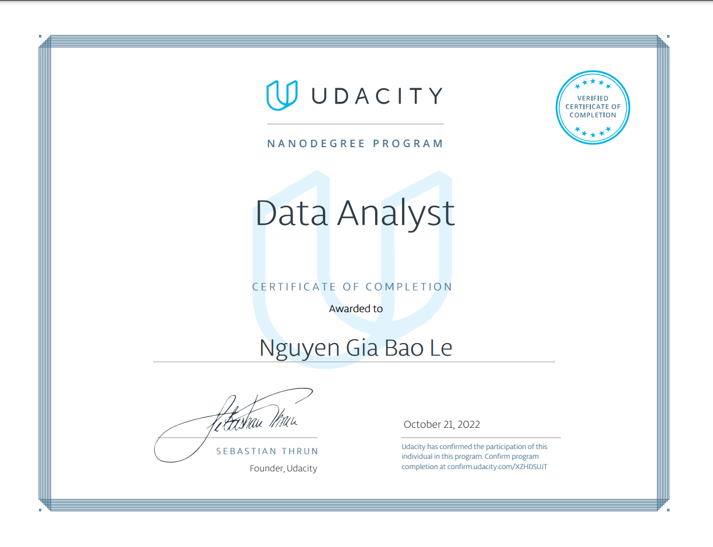

# data_analyst_course_udacity

##  GET_PASSES_THIS_REPO_UDACITY_PLEASE

The Data Engineer Nanodegree Course from Udacity

The structure of course:
- Introduction to Data Analysis: Learn the data analysis process of questioning, wrangling, exploring, analyzing, and communicating data. Learn how to work with data in Python using libraries like NumPy and Pandas.
- Pratical Statistics: Learn how to apply inferential statistics and probability to important, real-world scenarios, such as analyzing A/B tests and building supervised learning models.
- Data Wrangling: Learn the data wrangling process of gathering, assessing, and cleaning data. Learn how to use Python to wrangle data programmatically and prepare it for deeper analysis.
- Data Visualization: Learn to apply sound design and data visualization principles to the data analysis process. Learn how to use analysis and visualizations to tell a story with data.

