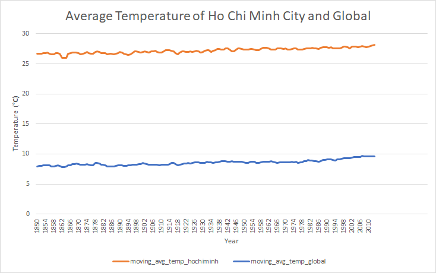

# Explore Weather Trends

Analyze Ho Chi Minh City (Vietnam) temperature data with global temperature data and compare the temperature trends of Ho Chi Minh City temperature overall global temperature trends. The analyze is from 1850 to 2013.

Step of analyze:

- Extract the data: write `sql query` to get data from database and save as `csv` file
- Process data: moving temperature of Ho Chi Minh City and global in the same source
- Calculate moving average temperature: get moving average by 3 recent years
- Plot the line chart to visualize the trend of average temperature

SQL Query of Extract Data Step:

- Extract data from "city_list" table:

  ```sql
  select * from city_list
  ```

- Extract data from "city_data" table:

  ```sql
  select * from city_data where city_data.city='Ho Chi Minh City'
  ```

- Extract data from "global_data" table:

  ```sql
  select * from global_data
  ```

Line Chart:



Observations:

- The temperature of Ho Chi Minh City is higher than temperature of global
- The average deviant of 2 place is about 18.65 degree
- The change average temperature in Ho Chi Minh City and in global is same, less different by the years
- The trend of average temperature of global is increase (see the blue line in chart)
- The average temperature of global was consistent over the last few hundred years
